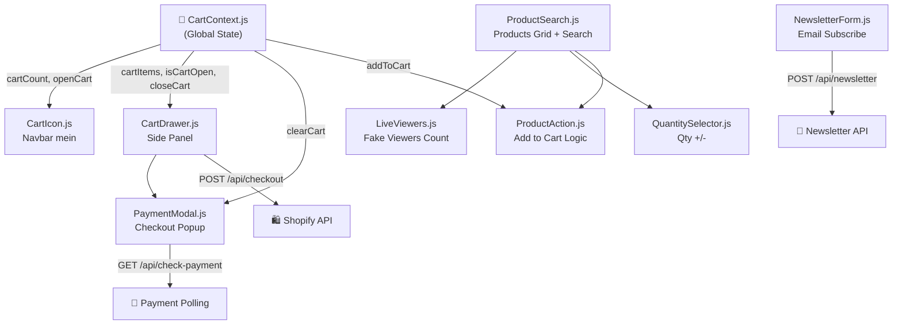

# 🔬 Components Deep Dive — `components/`

## 📊 Component Interaction Map



---

## 1. 🛒 `CartIcon.js` — Navbar Cart Button

**Ye sirf 18 lines ka hai lekin kaam bohot smart hai.**

```js
const { cartCount, openCart } = useCart();
```

### Logic:
- `CartContext` se do cheezein leta hai: `cartCount` aur `openCart`
- Agar `cartCount > 0` hai tabhi **badge** dikhata hai (conditional rendering)
- Badge pe `animate-bounce` laga hai — jab cart mein kuch hota hai to number uchalna shuru karta hai

### React Concept Used:
| Concept | Kahan |
|---|---|
| `useContext` (via custom hook) | `useCart()` |
| Conditional Rendering | `{cartCount > 0 && <span>}` |

> [!NOTE]
> Agar cart khali hai to badge bilkul gayab ho jata hai — `display:none` nahi, balke DOM se completely remove hota hai.

---

## 2. 📦 `CartDrawer.js` — Sliding Cart Panel

**Yeh poori website ka ek major component hai. Isme multiple responsibilities hain.**

### State:
```js
const [isLoading, setIsLoading] = useState(false);   // Checkout button ka loader
const [isModalOpen, setIsModalOpen] = useState(false); // PaymentModal control
```

### CSS Trick — Slide In/Out Animation:
```js
className={`fixed top-0 right-0 h-full w-80 ... transform transition-transform duration-300
  ${isCartOpen ? 'translate-x-0' : 'translate-x-full'}`}
```
- `translate-x-full` = screen se bahar (right mein chhupi hui)
- `translate-x-0` = screen pe aa gayi
- `transition-transform duration-300` = smoothly slide karta hai

### Total Bill Calculation:
```js
const cartTotal = cartItems.reduce((total, item) => total + (item.price * item.qty), 0);
```
- `reduce()` array ka har item lete hai aur running total banata hai

### `handleCheckout` Function — Sabse Important:
```
Step 1: Loading true kar do
Step 2: POST /api/checkout pe cart items bhej do
Step 3: Shopify se checkoutUrl milti hai
Step 4: us URL ko naye tab mein open karo (window.open)
Step 5: PaymentModal khol do jo polling shuru karega
Step 6: Cart Drawer band kar do
```

> [!IMPORTANT]
> `window.open(data.checkoutUrl, '_blank')` — ye Shopify ka **secure payment page** hai jo naye tab mein khulta hai. Hum credit card yahan handle nahi karte, Shopify karta hai.

---

## 3. 🔍 `ProductSearch.js` — Products Grid + Live Search

**Yeh sabse complex component hai. Isme `useMemo` ka smart use hai.**

### Props:
```js
function ProductSearch({ initialProducts }) { ... }
// initialProducts = Shopify se aaya hua array (server pe fetch hua tha)
```

### `useMemo` — Performance Optimization:
```js
const filteredProducts = useMemo(() => {
  if (!searchTerm) return initialProducts;
  return initialProducts.filter(({ node: product }) => {
    const titleMatch = product.title.toLowerCase().includes(searchTerm.toLowerCase());
    const descMatch = product.description.toLowerCase().includes(searchTerm.toLowerCase());
    return titleMatch || descMatch;
  });
}, [searchTerm, initialProducts]); // Dependency Array
```

**`useMemo` kyu zaruri hai?**
- Bina `useMemo` ke: Har keystroke pe poora filter dobara chalta (wasteful)
- `useMemo` ke saath: Filter sirf tab chalta hai jab `searchTerm` ya `initialProducts` actually change ho

### Nested Loop — Product ka Structure:
```
filteredProducts (Array)
  └── product (har product)
          └── product.variants.edges (Array)
                  └── variant (har variant — size, color etc.)
                          └── <QuantitySelector /> + <ProductAction />
```

### ✕ Clear Button:
```js
{searchTerm && (
  <button onClick={() => setSearchTerm('')}>✕</button>
)}
```
Sirf tab dikhta hai jab kuch type kiya ho — conditional rendering again.

---

## 4. 🎯 `ProductAction.js` — Add to Cart with Pledge Mode

**Isme ek unique "Pledge System" hai — user poora price nahi, 20% advance deta hai.**

### Props:
```js
function ProductAction({ priceAmount, currency, variantId, title })
```

### Pledge Calculation:
```js
const numericPrice = parseFloat(priceAmount); // String se Number banaya
const pledgeAdvance = (numericPrice * 0.2).toFixed(2); // 20% of price, 2 decimal places
```

### Mode Switching Logic:
```js
const [selectedMode, setSelectedMode] = useState("Full Price");
```
- `"Full Price"` → User poora price deta hai
- `"Pledge Mode"` → User sirf 20% advance deta hai, baaki delivery pe

### `useEffect` — Mode Change Logger:
```js
useEffect(() => {
  console.log(`Lifecycle Hook Triggered: User switched to [${selectedMode}] mode.`);
}, [selectedMode]);
```
Yeh sirf **debug/learning** ke liye hai. Production mein remove karna chahiye.

### `handleAddClick` — Cart Item Object:
```js
const itemData = {
  id: variantId,        // Shopify ka unique Variant ID
  title: title,         // Product name
  price: finalPrice,    // Full ya 20% based on mode
  mode: selectedMode,   // "Full Price" ya "Pledge Mode"
  currency: currency,   // "USD", "PKR" etc.
};
addToCart(itemData); // CartContext mein bhej do
```

> [!WARNING]
> `QuantitySelector` component ke qty ka `ProductAction` se koi connection nahi! User agar qty 3 kare, par "Add to Cart" dabaye to sirf 1 item jata hai. Yeh ek **bug/limitation** hai.

---

## 5. 🔢 `QuantitySelector.js` — Simple +/- Counter

**Sabse simple component — sirf apna local state manage karta hai.**

```js
const [quantity, setQuantity] = useState(1);
const increase = () => setQuantity(prev => prev + 1);
const decrease = () => setQuantity(prev => (prev > 1 ? prev - 1 : 1)); // Min = 1
```

### Minus Button Disabled Logic:
```js
disabled={quantity === 1}
```
Jab quantity 1 ho to minus button disable ho jata hai — 0 ya negative nahi jaata.

> [!WARNING]
> Yeh component `ProductAction` se **isolated** hai — dono apna alag state rakhte hain. Ye quantity actually cart mein count nahi hoti.

---

## 6. 👀 `LiveViewers.js` — Fake "X People Viewing" Widget

**Yeh ek UX/marketing trick hai — urgency create karne ke liye.**

### `setInterval` + `useEffect`:
```js
useEffect(() => {
  const interval = setInterval(() => {
    const change = Math.floor(Math.random() * 5) - 2; // -2 se +2 tak random
    setViewers(prev => (prev + change > 5 ? prev + change : 5)); // Minimum 5
  }, 4000); // Har 4 second baad

  return () => clearInterval(interval); // ← CLEANUP!
}, []);
```

### ⭐ Cleanup Function — Yeh Bohot Important Hai:
```
Component Mount hota hai → interval start hota hai
User dusre page pe jata hai → Component unmount hota hai → return ke andar clearInterval() chalta hai
```
**Agar cleanup na ho:** Interval background mein chalta rahega (Memory Leak!) — even page change ke baad bhi setViewers call hota rahega.

`[]` empty dependency array = sirf component mount/unmount pe chale, baar baar nahi.

---

## 7. 📧 `NewsletterForm.js` — Email Subscribe Form

**Isme State Machine pattern use hua hai.**

### Status States:
```js
const [status, setStatus] = useState('idle'); // 'idle' | 'loading' | 'success' | 'error'
```

Yeh ek "State Machine" jaisi cheez hai:
```
idle → (submit) → loading → (success) → success
                          → (fail)    → error
```

### `e.preventDefault()` — Kyu Zaruri Hai:
```js
const handleSubscribe = async (e) => {
  e.preventDefault(); // Browser default form submit (page reload) rokna
  ...
}
```
Bina iske browser page reload kar deta.

### Conditional UI Based on Status:
```js
{message && (
  <div className={status === 'success' ? 'bg-green-500/20 ...' : 'bg-red-500/20 ...'}>
    {message}
  </div>
)}
```
- Green box = success
- Red box = error
- Sirf tab show hoga jab `message` string non-empty ho

---

## 8. 💳 `PaymentModal.js` — Payment Confirmation Popup

**Sabse advanced component — Polling Architecture use karta hai.**

### Polling Kya Hota Hai?
```
Normal way: User "Check Payment" button dabata hai
Polling way: App automatically har 3 second baad khud check karti rahti hai
```

### `useEffect` Polling Logic:
```js
useEffect(() => {
  let pollInterval;

  if (isOpen) {
    setPaymentStatus('waiting');
    pollInterval = setInterval(async () => {
      const res = await fetch('/api/check-payment');
      const data = await res.json();

      if (data.status === 'paid') {
        setPaymentStatus('success'); // UI change karo
        clearCart();                  // Cart khali karo
        clearInterval(pollInterval); // Polling band karo
      }
    }, 3000); // Har 3 second baad
  }

  return () => clearInterval(pollInterval); // Cleanup!
}, [isOpen, clearCart]);
```

### Dependency Array `[isOpen, clearCart]`:
- `isOpen` change ho (modal khule/bande) to effect dobara chale
- `clearCart` ko include kiya warna React warning deta

### Two UI States:
```
paymentStatus === 'waiting' → Spinner + "Awaiting Payment..." text
paymentStatus === 'success' → ✓ Green icon + "Payment Successful!"
```

---

## 📝 Summary Table

| Component | Hooks Used | Main Kaam | Complexity |
|---|---|---|---|
| `CartIcon` | `useCart()` | Cart count dikhana, drawer open | ⭐ Easy |
| `CartDrawer` | `useCart()`, `useState` | Items list, total, checkout trigger | ⭐⭐⭐ Medium |
| `ProductSearch` | `useState`, `useMemo` | Live search + products grid | ⭐⭐⭐ Medium |
| `ProductAction` | `useState`, `useEffect`, `useCart()` | Pledge/Full mode, cart add | ⭐⭐⭐ Medium |
| `QuantitySelector` | `useState` | +/- counter | ⭐ Easy |
| `LiveViewers` | `useState`, `useEffect` | Fake viewers count animation | ⭐⭐ Easy+ |
| `NewsletterForm` | `useState` | Email form + API call | ⭐⭐ Easy+ |
| `PaymentModal` | `useState`, `useEffect`, `useCart()` | Payment polling, success screen | ⭐⭐⭐⭐ Hard |

---

## 🐛 Known Bugs / Limitations

1. **`QuantitySelector` ↔ `ProductAction` disconnected** — Qty selector ka number cart mein nahi jata
2. **`ProductAction` mein mode string inconsistency** — `setSelectedMode("Full Price")` set karta hai par check `=== "pledge"` (lowercase) se karta hai — Pledge mode kabhi trigger nahi hoga correctly
3. **`PaymentModal` hamesha `paid` nahi detect karega** — `/api/check-payment` route ko actually Shopify webhook data dekhna chahiye, warna polling kuch nahi karti

