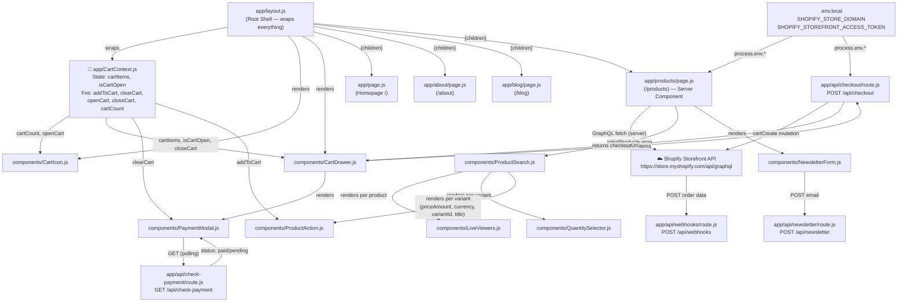

# 🔗 File Connection Points — Complete Map

## 🗺️ Master Diagram (Poora Project Ek Nazar Mein)



---

## 📋 Per-File Connection Table

### `app/layout.js` — Root Shell
| Direction | Connected To | Kya Deta/Leta Hai |
|---|---|---|
| **Imports** | `app/CartContext.js` | `CartProvider` component |
| **Imports** | `components/CartIcon.js` | Navbar ka cart button |
| **Imports** | `components/CartDrawer.js` | Slide-in drawer |
| **Imports** | `app/globals.css` | Global styles |
| **Wraps** | Poori app | `<CartProvider>` ke andar sab kuch |
| **Renders** | `{children}` | Har page yahan fit hota hai |

---

### `app/CartContext.js` — Global Brain
| Direction | Connected To | Kya Deta/Leta Hai |
|---|---|---|
| **Provides TO** | `CartIcon.js` | `cartCount`, `openCart` |
| **Provides TO** | `CartDrawer.js` | `cartItems`, `isCartOpen`, `closeCart` |
| **Provides TO** | `PaymentModal.js` | `clearCart` |
| **Provides TO** | `ProductAction.js` | `addToCart` |
| **Used via** | `useCart()` hook | Sabhi 4 files isko same hook se use karti hain |

---

### `app/products/page.js` — Main Products Page
| Direction | Connected To | Kya Deta/Leta Hai |
|---|---|---|
| **Fetches FROM** | Shopify API ☁️ | GraphQL: first 6 products + variants |
| **Reads** | `.env.local` | `SHOPIFY_STORE_DOMAIN`, `SHOPIFY_STOREFRONT_ACCESS_TOKEN` |
| **Passes TO** | `ProductSearch.js` | `initialProducts` prop (full products array) |
| **Renders** | `NewsletterForm.js` | Page ke bottom mein |

---

### `app/api/checkout/route.js` — Checkout Backend
| Direction | Connected To | Kya Deta/Leta Hai |
|---|---|---|
| **Called BY** | `CartDrawer.js` | `POST /api/checkout` with `{ items: [...] }` |
| **Calls TO** | Shopify API ☁️ | `cartCreate` GraphQL mutation |
| **Reads** | `.env.local` | Store domain + token |
| **Returns TO** | `CartDrawer.js` | `{ checkoutUrl: "https://..." }` |

---

### `app/api/check-payment/route.js` — Payment Status Checker
| Direction | Connected To | Kya Deta/Leta Hai |
|---|---|---|
| **Called BY** | `PaymentModal.js` | `GET /api/check-payment` (har 3 sec) |
| **Returns TO** | `PaymentModal.js` | `{ status: "paid" \| "pending" }` |
| **Note** | Currently hardcoded | Hamesha `"paid"` return karta hai (demo) |

---

### `app/api/newsletter/route.js` — Email Subscription
| Direction | Connected To | Kya Deta/Leta Hai |
|---|---|---|
| **Called BY** | `NewsletterForm.js` | `POST /api/newsletter` with `{ email }` |
| **Returns TO** | `NewsletterForm.js` | `{ message }` ya `{ error }` |
| **Note** | DB nahi hai | Sirf `console.log` karta hai (demo) |

---

### `app/api/webhooks/route.js` — Shopify Event Listener
| Direction | Connected To | Kya Deta/Leta Hai |
|---|---|---|
| **Called BY** | Shopify ☁️ | Payment complete hone par auto-POST |
| **Receives** | Shopify | Order data: `id`, `total_price` etc. |
| **Note** | DB nahi hai | Sirf `console.log` (demo) — Real mein DB update hota |

---

### `components/CartIcon.js`
| Direction | Connected To | Kya Deta/Leta Hai |
|---|---|---|
| **Imports** | `CartContext.js` | `useCart()` → `cartCount`, `openCart` |
| **Rendered BY** | `layout.js` | Navbar mein hamesha visible |
| **Triggers** | `CartDrawer.js` | `openCart()` → drawer slide in |

---

### `components/CartDrawer.js`
| Direction | Connected To | Kya Deta/Leta Hai |
|---|---|---|
| **Imports** | `CartContext.js` | `useCart()` → `cartItems`, `isCartOpen`, `closeCart` |
| **Imports** | `PaymentModal.js` | Checkout ke baad modal dikhana |
| **Rendered BY** | `layout.js` | Har page pe globally present |
| **Calls** | `/api/checkout` | Cart items bhejta hai, URL leta hai |
| **Controls** | `PaymentModal.js` | `isModalOpen` state se open/close |

---

### `components/PaymentModal.js`
| Direction | Connected To | Kya Deta/Leta Hai |
|---|---|---|
| **Imports** | `CartContext.js` | `useCart()` → `clearCart` |
| **Rendered BY** | `CartDrawer.js` | `isModalOpen` prop ke saath |
| **Polls** | `/api/check-payment` | Har 3 sec GET request |
| **Props receive** | `CartDrawer.js` | `isOpen`, `onClose` |

---

### `components/ProductSearch.js`
| Direction | Connected To | Kya Deta/Leta Hai |
|---|---|---|
| **Props receive** | `products/page.js` | `initialProducts` (Shopify data) |
| **Renders** | `LiveViewers.js` | Har product card mein |
| **Renders** | `QuantitySelector.js` | Har variant mein |
| **Renders** | `ProductAction.js` | Har variant mein (4 props pass karta hai) |

---

### `components/ProductAction.js`
| Direction | Connected To | Kya Deta/Leta Hai |
|---|---|---|
| **Imports** | `CartContext.js` | `useCart()` → `addToCart` |
| **Props receive** | `ProductSearch.js` | `priceAmount`, `currency`, `variantId`, `title` |
| **Calls** | `CartContext.addToCart()` | Item object bhejta hai |

---

### `components/QuantitySelector.js`
| Direction | Connected To | Kya Deta/Leta Hai |
|---|---|---|
| **Rendered BY** | `ProductSearch.js` | Har variant mein |
| **Connected TO** | ❌ Kuch nahi | Isolated — apna local `quantity` state rakhta hai |
| **Note** | Bug | `ProductAction` se koi link nahi — qty cart mein nahi jati |

---

### `components/LiveViewers.js`
| Direction | Connected To | Kya Deta/Leta Hai |
|---|---|---|
| **Rendered BY** | `ProductSearch.js` | Har product card mein |
| **Connected TO** | ❌ Kuch nahi | Fully self-contained — koi props, koi context |

---

### `components/NewsletterForm.js`
| Direction | Connected To | Kya Deta/Leta Hai |
|---|---|---|
| **Rendered BY** | `products/page.js` | Products page ke bottom mein |
| **Calls** | `/api/newsletter` | `POST` with `{ email }` |
| **Connected TO** | ❌ Context nahi | Fully self-contained |

---

## 🎯 Props Contract — Kya Kya Pass Hota Hai

```
products/page.js
  └──► ProductSearch   : initialProducts={products}   (Array of Shopify edges)

ProductSearch.js
  └──► ProductAction   : priceAmount={variant.price.amount}   (String: "29.99")
                       : currency={variant.price.currencyCode} (String: "USD")
                       : variantId={variant.id}               (String: Shopify ID)
                       : title={product.title}                (String: product name)
  └──► QuantitySelector: (no props — standalone)
  └──► LiveViewers     : (no props — standalone)

CartDrawer.js
  └──► PaymentModal    : isOpen={isModalOpen}   (Boolean)
                       : onClose={() => setIsModalOpen(false)} (Function)
```

---

## ⚡ Data Flow — 3 Main Journeys

### Journey 1: Product → Cart
```
Shopify API ──► products/page.js ──► ProductSearch ──► ProductAction
                                                              │
                                                    addToCart(itemData)
                                                              │
                                                       CartContext
                                                    ┌──────┴───────┐
                                                 CartIcon        CartDrawer
                                               (count badge)   (items list)
```

### Journey 2: Cart → Shopify Checkout
```
CartDrawer (Checkout button)
    │
    POST /api/checkout  ←── cartItems
    │
    Shopify API (cartCreate mutation)
    │
    checkoutUrl returned
    │
    window.open(checkoutUrl) → Shopify Payment Page (new tab)
    │
    PaymentModal opens → polls /api/check-payment every 3s
    │
    status: "paid" → clearCart() → Success UI
```

### Journey 3: Newsletter
```
NewsletterForm (email input)
    │
    POST /api/newsletter  ←── { email }
    │
    Validation → console.log (demo)
    │
    { message: "success" } OR { error: "..." }
    │
    UI: Green box OR Red box
```

---

## 🏝️ Isolated Files (Kisi se connected nahi)

| File | Reason |
|---|---|
| `QuantitySelector.js` | No props out, no context — pure local state |
| `LiveViewers.js` | No props, no context — self-contained timer |
| `app/about/page.js` | Standalone page, koi import nahi |
| `app/blog/page.js` | Standalone page, koi import nahi |
| `app/api/webhooks/route.js` | Sirf Shopify se sunti hai, kisi component se nahi |
