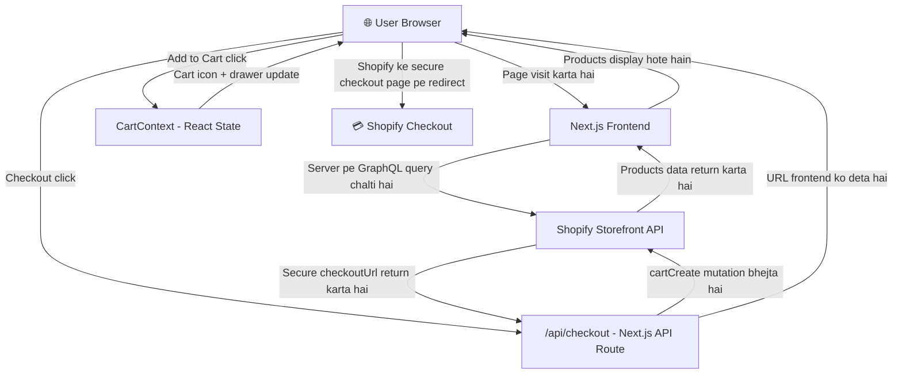

# 🗺️ Project Bird's-Eye View — `my-test-website`

## 🧠 Project Kya Hai?

Ye ek **Shopify-powered e-commerce website** hai jo **Next.js 16** ke saath bani hui hai.  
Shopify backend ki tarah kaam karta hai (products, payments), aur Next.js frontend + API layer provide karta hai.

---

## ⚙️ Tech Stack

| Technology | Version | Kaam |
|---|---|---|
| **Next.js** | 16.2.4 | Full-stack React framework |
| **React** | 19.2.4 | UI library |
| **Tailwind CSS** | v4 | Styling |
| **Shopify Storefront API** | 2024-01 | Products + Checkout data |

---

## 🗂️ Folder Structure (Simplified)

```
my-test-website/
│
├── app/                        ← Next.js App Router (Pages + API)
│   ├── layout.js               ← Root Layout: Navbar, Footer, CartDrawer
│   ├── page.js                 ← Homepage (/)
│   ├── CartContext.js          ← Global Cart State (React Context)
│   │
│   ├── about/page.js           ← About page (/about)
│   ├── blog/page.js            ← Blog listing (/blog)
│   ├── blog/[slug]/            ← Individual blog post (/blog/some-post)
│   ├── products/page.js        ← Products listing (/products) ← MAIN PAGE
│   │
│   └── api/                    ← Next.js Backend API Routes
│       ├── checkout/route.js   ← Shopify cart banana + checkoutUrl lena
│       ├── check-payment/      ← Payment verify karna
│       ├── newsletter/         ← Email subscription
│       └── webhooks/           ← Shopify events sunna
│
├── components/                 ← Reusable UI Components
│   ├── CartIcon.js             ← Navbar ka cart icon (count dikhata hai)
│   ├── CartDrawer.js           ← Side se khulanay wala cart panel
│   ├── ProductSearch.js        ← Products filter + display karna
│   ├── ProductAction.js        ← "Add to Cart" button logic
│   ├── QuantitySelector.js     ← +/- quantity buttons
│   ├── PaymentModal.js         ← Checkout ka modal/popup
│   ├── LiveViewers.js          ← "X people viewing this" widget
│   └── NewsletterForm.js       ← Email subscribe form
│
├── public/                     ← Static files (images, icons)
├── .env.local                  ← 🔑 SECRET KEYS (Shopify credentials)
└── next.config.mjs             ← Next.js configuration
```

---

## 🔄 Data Flow — Kaise Kaam Karta Hai?



---

## 🔑 Core Concepts Explained

### 1. `CartContext.js` — Global Cart Memory
- Poori app ka **ek central cart state** hai
- `CartProvider` ne poori app ko wrap kiya hua hai (`layout.js` mein)
- Koi bhi component `useCart()` hook se cart access kar sakta hai
- Functions: `addToCart`, `clearCart`, `openCart`, `closeCart`

### 2. `/products/page.js` — Main Products Page
- Ye ek **Server Component** hai (async function)
- Directly Shopify se GraphQL query karta hai (server pe, browser pe nahi)
- Pehle **6 products** fetch karta hai with variants aur prices
- Data `ProductSearch` component ko pass karta hai

### 3. `/api/checkout/route.js` — Checkout Backend
- Ek **secure backend API route** hai
- Frontend cart items receive karta hai
- Shopify ko `cartCreate` GraphQL mutation bhejta hai
- Shopify ka **secure `checkoutUrl`** wapis karta hai
- User us URL pe redirect ho jata hai aur payment wahan hoti hai

### 4. Components Flow
```
products/page.js
    └── ProductSearch.js        ← Search + filter UI
            └── ProductAction.js    ← Variant select + Add to Cart
                    └── useCart()       ← CartContext mein item add karna
                            └── CartDrawer.js   ← Side panel mein dikhta hai
                                    └── PaymentModal.js ← Checkout trigger
                                            └── /api/checkout ← Shopify URL milta hai
```

---

## 🔐 Environment Variables (`.env.local`)

```
SHOPIFY_STORE_DOMAIN=your-store.myshopify.com
SHOPIFY_STOREFRONT_ACCESS_TOKEN=your_token_here
```

> [!IMPORTANT]
> Ye keys kabhi bhi GitHub pe push mat karo! `.gitignore` mein already add hai.

---

## 📄 Pages Summary

| Route | File | Description |
|---|---|---|
| `/` | `app/page.js` | Simple homepage with links |
| `/about` | `app/about/page.js` | About page |
| `/blog` | `app/blog/page.js` | Blog posts listing |
| `/blog/[slug]` | `app/blog/[slug]/` | Individual blog post |
| `/products` | `app/products/page.js` | **Main Shopify products page** |

---

## 🚀 Project Run Karna

```bash
npm run dev
```
> Local pe `http://localhost:3000` pe open hoga
